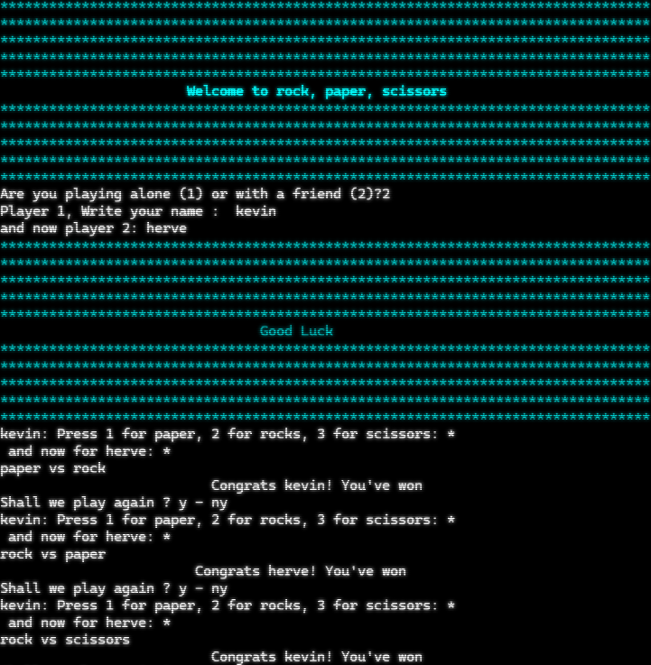

RPS-NodeJs Version 06.23
<h1>Welcome to Rock Paper Scissors</h1>

Meet a very simple 2 players <i>rock paper scissors</i> game in nodejs. To make this work you shouldn't need anything if you're using the released version if you want to play with the code you will need Nodejs installed but also the password-prompt module.
You shouldn't need to install it since it's in the folder. Simply download the zip, uncompress it, position yourself in it with the terminal and lunch the program with the commande:
<i>node thejsfile.js</i>

Here you will found the game files, screenshots, .exe.

<h2>Games functions:</h2>
-Write your names  
-hides the moves from the players to prevent cheating and give the users a more typo proof interface  
-Relunch of the game at the end.  
-A scoreboard tell you the name of the winner and number of games won.  
-you can play alone with the option to play with a small bot called Jerry.(different file)  

<h3>Screenshots: </h3>

